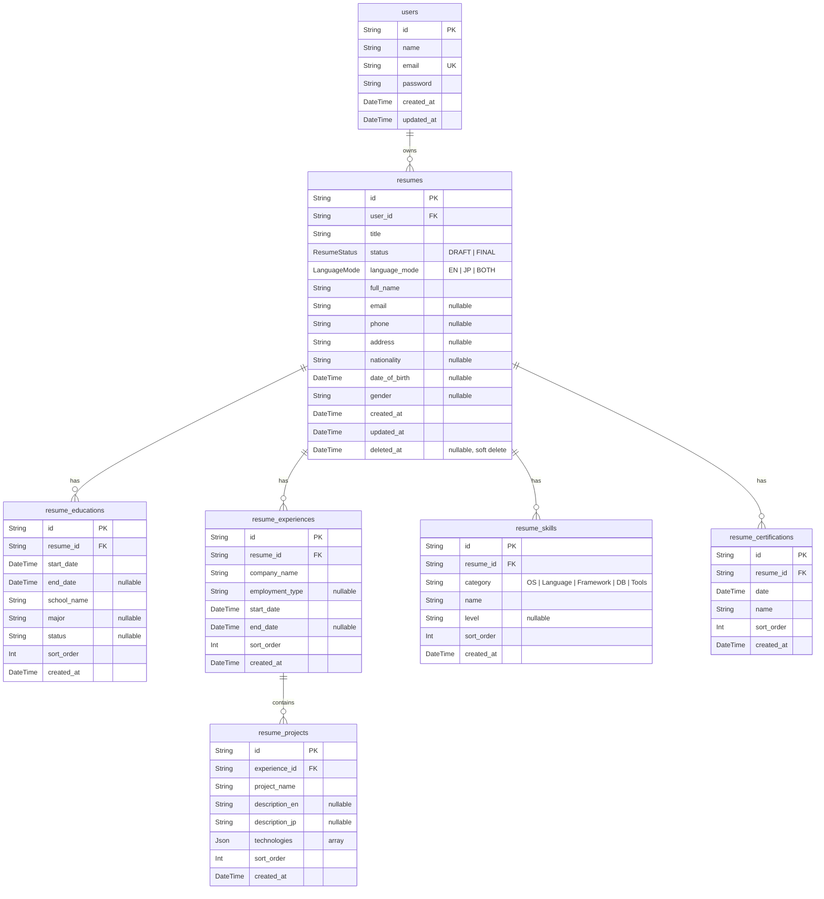

# Database Schema

## Entity Relationship Diagram

## Tables

### users
Core user account. One user can own many resumes.

### resumes
Main resume entity with personal info merged in. Holds title, status (draft/final), language mode (en/jp/both), and basic personal details (name, contact, nationality, etc.). Uses soft delete via `deleted_at`.

### resume_educations
Education history entries (1:N with resume). Supports ongoing education via nullable `end_date`.

### resume_experiences
Work experience entries (1:N with resume). Each experience can contain nested projects.

### resume_projects
Projects nested under a work experience (1:N with resume_experiences). Supports bilingual descriptions (EN/JP) and a JSON array for technologies.

### resume_skills
Categorized skills (1:N with resume). Grouped by category (OS, Language, Framework, DB, Tools) with proficiency level.

### resume_certifications
Certifications and qualifications (1:N with resume).

## Key Design Decisions

- **Soft delete** on `resumes` via `deleted_at` column (NULL = active)
- **Cascade deletes** on all child relations — deleting a resume cleans up all sections
- **`sort_order`** on all list tables — enables drag-and-drop reordering in the UI
- **JSON columns** used sparingly — only for `technologies` where flexibility outweighs queryability
- **Bilingual support** via `description_en`/`description_jp` on projects
- **Templates as code** — layout templates live as React components in the codebase, not in the database
- **Personal info merged into `resumes`** — avoids unnecessary 1:1 join table
